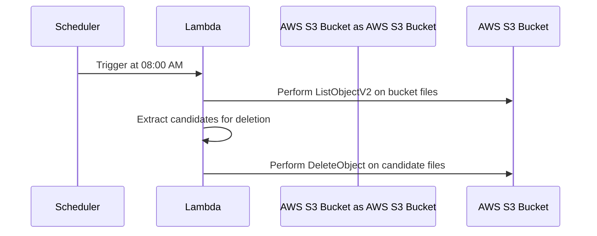

# tariff-lambdas-electronic-tariff-file-rotations

Scheduled go lambda function to rotate reports in the reporting bucket
(including the Electronic Tariff files).

## License

[MIT License](LICENSE)
